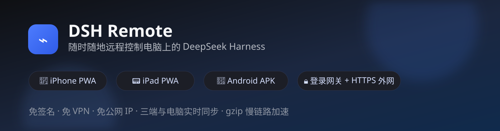
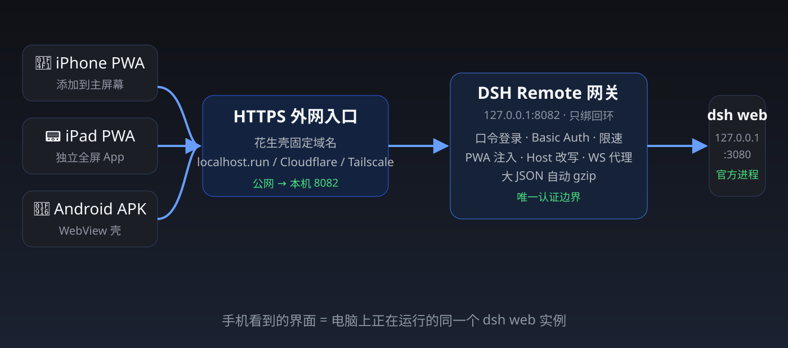

# DSH Remote

**用 iPhone、iPad、安卓随时随地远程控制电脑上的 [DeepSeek Harness](https://github.com/deepseek-ai/deepseek-harness)（dsh）。**
手机和电脑看到的是**同一个运行中的实例**：会话、审批、工具执行、文件操作实时同步。



| | |
|---|---|
| 🌐 展示页 | [rs-lxy.github.io/dsh-remote-123](https://rs-lxy.github.io/dsh-remote-123/) |
| 📦 仓库 | [github.com/rs-lxy/dsh-remote-123](https://github.com/rs-lxy/dsh-remote-123) |
| 📄 许可 | MIT（第三方组件见 `THIRD_PARTY_NOTICES.md`） |

---

## 能做什么

- **iPhone / iPad**：Safari「添加到主屏幕」即成为独立全屏 PWA，无需签名、TestFlight 或越狱；
- **安卓**：`dist/android/` 内置两个现成 WebView 壳 APK，填地址和口令即用；
- **出门可用**：花生壳固定 HTTPS 域名 / localhost.run / Cloudflare Tunnel / Tailscale 任选，手机端不装 VPN 也能访问；
- **安全边界**：口令登录 + HttpOnly cookie + 登录限速；dsh 始终只绑 `127.0.0.1`，公网只能经过 HTTPS 网关；
- **移动端 UI**：集成 `@dsh/mobile-adapt`（单列布局、全屏抽屉、全屏设置/详情、输入栏换行、防 iOS 聚焦缩放）；
- **慢链路加速**：会话历史等大 JSON 自动 gzip，实测 4.45MB → 0.35MB，27.6s → 1.4s。

## 架构



设计原因：dsh 官方**拒绝绑定 0.0.0.0**（防止把可执行命令接口暴露到网络），且官方文档明确
`trustedHosts` **不是认证层**。因此本项目把认证放在独立网关上，dsh 保持回环绑定不变。

## 目录结构

```
dsh-remote-123/
├── server/
│   ├── gateway.mjs               # 零依赖网关：登录 + PWA 注入 + 反代 + WS + gzip
│   ├── assets/                   # 登录页、manifest、SW、离线页、CSS、图标
│   ├── mobile-adapt/             # 移动端 UI 插件（juanlian583/dsh-mobile-adapt, MIT）
│   ├── mobile-fit/               # 旧版移动端插件（joyfish, MIT，可选回退）
│   └── scripts/                  # 启动 / 隧道 / 自启 / 停止 / 查地址脚本
├── assets/
│   ├── diagrams/                 # README 用图（hero / 架构）
│   └── posters/                  # 宣传海报源图
├── tools/                        # 图标生成、自测、cloudflared 下载、海报生成
├── dist/android/                 # 现成安卓 APK × 2
└── docs/                         # iPhone PWA、安卓、隧道、花生壳教程 + Pages 首页
```

## 快速开始

### 0. 前置条件

- Node.js（建议 ≥ 18，本项目 **零 npm 依赖**）；
- 电脑上能启动 dsh web：
  ```bash
  npx @deepseek-ai/dsh web        # 默认 http://127.0.0.1:3080
  ```

### 1. 克隆并启动网关

```bash
git clone https://github.com/rs-lxy/dsh-remote-123.git
cd dsh-remote-123
```

Windows 上启动：

```powershell
powershell -NoProfile -ExecutionPolicy Bypass -File server\scripts\start-gateway.ps1
```

macOS / Linux：

```bash
node server/gateway.mjs
```

首次启动自动生成口令：`~/.dsh/dsh-remote.auth`（`user=dsh` + `password=随机值`）。
改口令：编辑该文件的 `password=` 行后重启网关。

### 2. 开一条外网通道（任选其一）

| 通道 | 启动方式 | 地址 | 说明 |
|---|---|---|---|
| **花生壳免费版（国内固定，推荐）** | 见 [docs/oray-guide.md](docs/oray-guide.md) | 固定 `*.vicp.fun` 等 | 需手机号注册 + 实名，HTTPS 自动证书 |
| **Pinggy（免注册，当前免费首选）** | `start-pinggy.ps1` | 免费随机 `*.pinggy.net/link`，约 60 分钟一换 | 手机网络实测可用；固定 `/go/` 入口自动跳最新 |
| **localhost.run（免注册）** | `start-remote.ps1` | 免费随机 `*.lhr.life` | 零账号快速体验，部分手机线路不通 |
| **NATAPP VIP_1（9 元/月）** | 见 [docs/natapp-guide.md](docs/natapp-guide.md) | 固定 `*.natapp.cn` + HTTPS | 最便宜的永久固定地址，推荐长期使用 |
| Cloudflare 快速隧道 | `install-cloudflared.ps1` → `start-cloudflare-tunnel.ps1` | 随机 `*.trycloudflare.com` | 部分国内线路被边缘过滤 |
| Cloudflare 固定域名 | `start-cloudflare-named.ps1 -TunnelName mydsh` | 自有域名固定 | 需域名，最稳 |
| Tailscale | `start-tailscale.ps1` | 固定 `*.ts.net` | 手机需装 Tailscale App |

> 网关默认只绑 `127.0.0.1:8082`。公网入口全部由隧道转发，**不要**设置
> `DSH_REMOTE_BIND=0.0.0.0` 直接暴露网关。

**固定入口（强烈建议收藏）**：`https://rs-lxy.github.io/dsh-remote-123/go/`
PC 上的 watchdog 会自动把当前最新可用地址发布到 GitHub，这个链接永远跳到最新地址。

> ⚠️ **免费随机地址会变**：Pinggy（约 60 分钟）、localhost.run / Cloudflare 快速隧道在电脑重启或隧道重连后会
> 分配新地址。电脑上双击 `server\scripts\show-url.bat` 查看当前地址；永久固定方案
> （NATAPP 9 元/月、花生壳正式版、cpolar、Cloudflare 自有域名、Tailscale）见
> [docs/stable-url-options.md](docs/stable-url-options.md)。

### 3. 安装移动端适配（推荐）

```powershell
powershell -NoProfile -ExecutionPolicy Bypass -File server\scripts\install-mobile-adapt.ps1
# 重启 dsh web 后生效
```

### 4. 手机接入

| 设备 | 操作 |
|---|---|
| iPhone / iPad | Safari 打开公网地址 → 输口令登录 → 分享 → **添加到主屏幕**（详见 [docs/ios-pwa-guide.md](docs/ios-pwa-guide.md)） |
| 安卓 | 安装 `dist/android/dsh-mobile-app-release.apk`，地址填 `https://你的地址/mobile`（详见 [docs/android-guide.md](docs/android-guide.md)） |

### 5. 开机自启（可选）

```powershell
powershell -NoProfile -ExecutionPolicy Bypass -File server\scripts\install-autostart.ps1
```

注册计划任务：`dsh-web`（已存在则保留）、`dsh-remote-gateway`、按需的隧道任务。

## 配置项

| 环境变量 | 默认值 | 说明 |
|---|---|---|
| `DSH_REMOTE_PORT` | `8082` | 网关监听端口 |
| `DSH_REMOTE_BIND` | `127.0.0.1` | 网关监听地址 |
| `DSH_REMOTE_UPSTREAM` | `http://127.0.0.1:3080` | dsh web 地址 |
| `DSH_REMOTE_TOKEN` | 读认证文件/自动生成 | 登录口令 |
| `DSH_REMOTE_USER` | `dsh` | Basic Auth 用户名 |
| `DSH_REMOTE_AUTH_FILE` | `~/.dsh/dsh-remote.auth` | 认证文件路径 |

## 公网部署红线（务必遵守）

- **绝不**把 dsh web（`127.0.0.1:3080`）直接映射到公网，也不要给 dsh 配置
  `--host 0.0.0.0`——那会把能执行命令/读写文件的接口直接暴露；
- 公网隧道（花生壳 / NATAPP / localhost.run / Cloudflare / Tailscale）只能指向
  **`127.0.0.1:8082` 登录网关**；
- 网关自身默认也只绑 `127.0.0.1`，不要设置 `DSH_REMOTE_BIND=0.0.0.0`；
- 本项目的安全边界是：**公网 → HTTPS 隧道 → 网关口令认证 → 回环 dsh**。

## 安全说明

- **口令就是唯一边界**：拿到口令 = 拿到电脑上 dsh 的执行能力，请改成强口令；
- 网关只绑回环，公网必须走 HTTPS 隧道；
- 登录限速：同一 IP 连续失败 5 次锁 10 秒，指数翻倍至 5 分钟；
- 会话 cookie 为 HttpOnly；WebSocket 仅放行 dsh 的 `events.mux/host` 通道；
- 网关把 Host/Origin 改写为 loopback 后，远程也能修改模型 / API Key / 权限——这是本项目
  设计目标，风险由网关口令抵消；
- 花生壳免费版约 1Mbps、月 1GB 流量，适合轻度远程办公；大文件请用带宽更大的通道。

## 实测记录

在 `dsh 0.1.0-rc.6`（Node 24，Windows）上验证通过：

| 项目 | 结果 |
|---|---|
| 登录页 / 口令错误 401 / 登录成功 Set-Cookie | ✅ |
| Basic Auth（dsh-mobile-app APK 路径）与 `/mobile` 302 | ✅ |
| PWA 注入（manifest / 图标 / SW / viewport / WS 引导） | ✅ |
| `/api/session.list`、`/api/settings.describe` 经网关可用 | ✅ |
| WebSocket `events.mux` / `events.host` 升级握手 | ✅ |
| `@dsh/mobile-adapt` 加载与移动端布局 | ✅ |
| gzip：`session.history` 4.45MB → 0.35MB，27.6s → 1.4s | ✅ |
| 花生壳 HTTPS 固定域名全链路（登录 / 页面 / API / WSS） | ✅ |

## 方案调研与参考

完整的前沿方案调研（GitHub / B 站 / V2EX / dev.to）见 [docs/remote-methods-survey.md](docs/remote-methods-survey.md)。

## 参考了什么 / 自己做了什么

### 参考与借用

| 项目 | 参考内容 |
|---|---|
| [deepseek-ai/deepseek-harness](https://github.com/deepseek-ai/deepseek-harness) | 官方 dsh 本体、信任围栏与插件机制 |
| [hongshuxifan321/dsh-mobile-app](https://github.com/hongshuxifan321/dsh-mobile-app) | 安卓 WebView 壳 + Basic Auth 代理 + loopback Host 改写 + 大 JSON gzip 思路；其 APK 收录于 `dist/android` |
| [joyfish666/deepseek-harness-remote](https://github.com/joyfish666/deepseek-harness-remote) | mobile-fit（MIT）、boot manifest 重排、WS cookie/token 技术；其 APK 收录于 `dist/android` |
| [juanlian583/dsh-mobile-adapt](https://github.com/juanlian583/dsh-mobile-adapt) | 当前默认移动端 UI 插件（MIT） |
| [shaobeichen/dsh-pocket](https://github.com/shaobeichen/dsh-pocket) | 调研参考：插件内置二维码、cloudflared 公网二维码、URL 即钥匙 |
| [@xiaosenho/dsh-plugin-remote-access](https://www.npmjs.com/package/@xiaosenho/dsh-plugin-remote-access) | 调研参考：frpc 隧道 + token 换 Cookie 认证 |
| [hchao3335-maker/dsh-lan-gate](https://github.com/hchao3335-maker/dsh-lan-gate) | 调研参考：首次访问设备批准、局域网门禁 |
| [citrusli2026/dsh-mobile-shell](https://github.com/citrusli2026/dsh-mobile-shell) | 调研参考：Capacitor 双端壳 + token 网关安全模型 |
| [icodesign/orbis](https://github.com/icodesign/orbis) | 调研参考：设备配对 + E2E 加密远程控制 |
| [stars2022/Dsh-macUI](https://github.com/stars2022/Dsh-macUI) | 调研参考：原生 SwiftUI iOS 客户端与加密中继 |

### 本项目自研

- 零依赖 `gateway.mjs`：登录页 + cookie/Basic Auth 双认证、登录限速、PWA 全套注入、
  Host/Origin loopback 改写、WebSocket 代理、HTML 重写、自动 gzip；
- 一键脚本族：`start-gateway / start-remote / start-localhostrun / start-tailscale /
  start-cloudflare-* / install-autostart / show-url / stop-remote`；
- mobile-fit ↔ mobile-adapt 的自动挂载 / 切换 / 卸载脚本；
- PWA 资源（manifest、Service Worker、离线页、图标）与移动端兜底 CSS；
- 花生壳 / localhost.run / Cloudflare / Tailscale 四通道中文教程与 Pages 展示页。

## 许可证

- 本项目自有代码：MIT（`LICENSE`）；
- `server/mobile-adapt`：MIT，来自 juanlian583/dsh-mobile-adapt；
- `server/mobile-fit`：MIT，来自 joyfish666/deepseek-harness-remote；
- `dist/android/*.apk`：原样收录自上游 Release，版权归原仓库；
- 详见 `THIRD_PARTY_NOTICES.md`。

本项目与 DeepSeek AI 无隶属关系，非官方产品。
